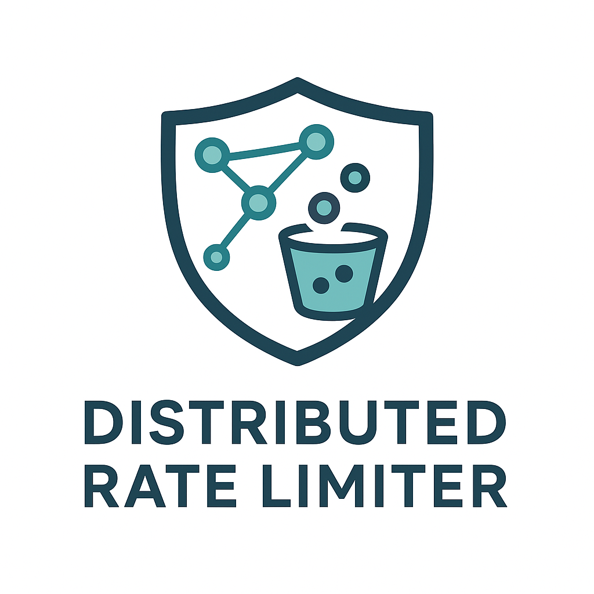
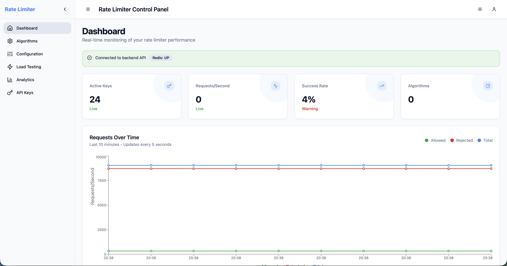
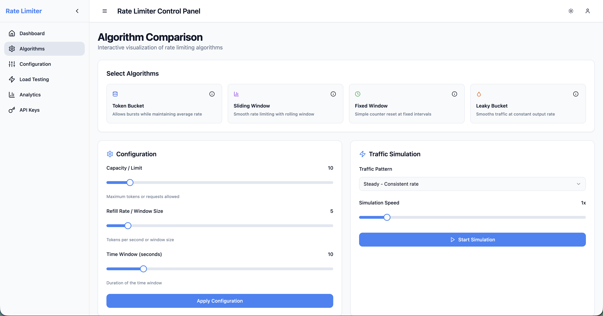
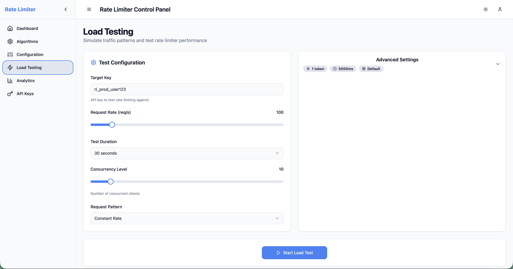
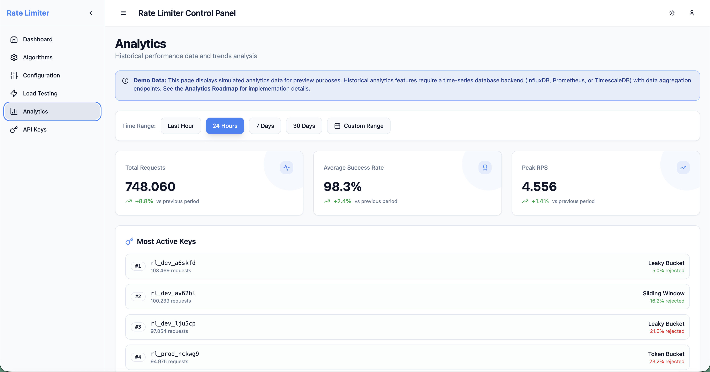

<div align="center">



# Distributed Rate Limiter

Production-oriented distributed rate limiting service built with Spring Boot and Redis, paired with an interactive evaluator frontend for demos, walkthroughs, and hiring-manager review.

[Live Evaluator](https://distributed-rate-limiter-evaluator.vercel.app) | [API Docs](http://localhost:8080/swagger-ui/index.html) | [Deployment Docs](docs/deployment/README.md) | [Dashboard Docs](examples/web-dashboard/README.md)

</div>

## Overview

This repository combines two related pieces:

- A Spring Boot backend for distributed rate limiting with Redis-backed state, dynamic configuration, monitoring, benchmarking, scheduling, adaptive logic, and geographic policy support.
- A React/Vite frontend that acts as a live evaluator for the project, including an interactive algorithm playground and a reviewer-friendly walkthrough hosted on Vercel.

The result is a repo that is useful both as an engineering artifact and as a project someone can actually inspect, run, and evaluate quickly.

## What The Project Includes

| Area | What it covers |
| --- | --- |
| Core rate limiting | Token Bucket, Sliding Window, Fixed Window, Leaky Bucket, and Composite strategies |
| Distributed state | Redis-backed coordination for multi-instance deployments |
| Runtime control | Default, per-key, and pattern-based configuration via REST APIs |
| Operations | Health checks, metrics, Docker assets, Kubernetes manifests, and runbooks |
| Performance work | Built-in benchmark endpoints and regression-analysis support |
| Advanced policies | Adaptive rate limiting, scheduling, and geographic rule support |
| Frontend evaluator | Live algorithm playground, analytics preview, and project showcase UI |

## Supported Algorithms

| Algorithm | Best for | Notes |
| --- | --- | --- |
| Token Bucket | Burst-tolerant APIs | Good default for many user-facing systems |
| Sliding Window | Smoother enforcement | Better when consistency matters more than burst absorption |
| Fixed Window | Simple enforcement | Easy to reason about, lower implementation complexity |
| Leaky Bucket | Traffic shaping | Useful when downstream systems need a steadier output rate |
| Composite | Multi-dimensional policies | Supports combining strategies for more advanced workloads |

## Key Capabilities

- Distributed rate limiting backed by Redis.
- REST APIs for runtime checks, configuration, scheduling, benchmarking, adaptive control, and geographic rules.
- Dynamic key-level and pattern-level overrides without code changes.
- Metrics and health endpoints suitable for dashboards and alerting.
- Built-in web dashboard and evaluator frontend.
- Docker and Kubernetes assets for local and production-style deployment.
- 75 test source files under `src/test` covering core behavior, integrations, and support utilities.

## Architecture

### Backend

- Spring Boot 3.5.x application running on Java 21.
- Redis used for distributed coordination and token state.
- REST controllers under `src/main/java/dev/bnacar/distributedratelimiter/controller`.
- Actuator health plus a custom `/metrics` endpoint for operational visibility.

### Frontend

- React 18 + TypeScript + Vite application in `examples/web-dashboard`.
- Includes a live evaluator experience at [distributed-rate-limiter-evaluator.vercel.app](https://distributed-rate-limiter-evaluator.vercel.app).
- Can also run locally against the backend on `http://localhost:8080`.

### Deployment split

- Vercel is used for the evaluator frontend.
- The Spring Boot + Redis backend is better suited to Docker, Kubernetes, ECS, Render, Fly.io, or similar container-friendly platforms.

## Screenshots

### Project Evaluator / Dashboard



The dashboard surfaces project context, system signals, and a polished review path for someone evaluating the repository.

### Algorithm Playground



The interactive playground makes the tradeoffs between algorithms visible without requiring a live Redis deployment.

### Configuration Interface


Configuration views cover global defaults, key-specific overrides, and pattern-based rules.

### Load Testing Interface



Load-testing screens connect to backend benchmarking flows for throughput and behavior inspection.

### Analytics Preview



Analytics is presented as a preview surface for historical observability and export flows.

### API Keys View


The dashboard also includes active-key inspection and admin-oriented views over live system usage.

## Quick Start

### Prerequisites

- Java 21
- Docker
- Node.js 18+ and npm

### Option 1: Run With Docker Compose

This is the fastest way to get the backend running locally with Redis.

```bash
git clone https://github.com/Kenxpx/Distributed-Rate-Limiter.git
cd Distributed-Rate-Limiter
docker compose up --build
```

Once the containers are healthy:

- API health: `http://localhost:8080/actuator/health`
- Metrics: `http://localhost:8080/metrics`
- Swagger UI: `http://localhost:8080/swagger-ui/index.html`

### Option 2: Run Backend Locally

Start Redis first:

```bash
docker run --name drl-redis -p 6379:6379 redis:7-alpine
```

Then start the Spring Boot application:

```bash
./mvnw spring-boot:run
```

On Windows PowerShell:

```powershell
.\mvnw.cmd spring-boot:run
```

### Option 3: Run The Frontend Locally

With the backend available on `http://localhost:8080`:

```bash
cd examples/web-dashboard
npm install
npm run dev
```

Then open `http://localhost:5173`.

## Live Demo

The live evaluator frontend is available here:

- [https://distributed-rate-limiter-evaluator.vercel.app](https://distributed-rate-limiter-evaluator.vercel.app)

Important note:

- This Vercel deployment hosts the evaluator frontend, not the full Spring Boot + Redis backend.
- The algorithm playground works in-browser.
- Backend-driven operational views are intended for local or container deployment.

## Local Defaults

The default application settings in [application.properties](src/main/resources/application.properties) include:

- Default capacity: `10`
- Default refill rate: `2`
- Cleanup interval: `60000ms`
- Redis enabled: `true`
- API key validation enabled: `true`
- Example valid API keys: `api-key-1`, `api-key-2`, `premium-key-123`

Admin endpoints under `/admin/**` use simple Basic Auth defaults in development:

- Username: `admin`
- Password: `admin123`

These defaults are acceptable for local development only and should be changed for any real deployment.

## API Examples

### Basic rate-limit check

```bash
curl -X POST http://localhost:8080/api/ratelimit/check \
  -H "Content-Type: application/json" \
  -d '{
    "key": "user:123",
    "tokens": 1,
    "apiKey": "api-key-1"
  }'
```

Example response:

```json
{
  "key": "user:123",
  "tokensRequested": 1,
  "allowed": true
}
```

### Read current configuration

```bash
curl http://localhost:8080/api/ratelimit/config
```

### Update a key-specific rule

```bash
curl -X POST http://localhost:8080/api/ratelimit/config/keys/premium_user \
  -H "Content-Type: application/json" \
  -d '{
    "capacity": 50,
    "refillRate": 10,
    "algorithm": "TOKEN_BUCKET"
  }'
```

### Run a benchmark

```bash
curl -X POST http://localhost:8080/api/benchmark/run \
  -H "Content-Type: application/json" \
  -d '{
    "concurrentThreads": 8,
    "requestsPerThread": 100,
    "durationSeconds": 10,
    "tokensPerRequest": 1,
    "keyPrefix": "bench"
  }'
```

### List active keys

```bash
curl -u admin:admin123 http://localhost:8080/admin/keys
```

## Endpoint Summary

| Area | Endpoints |
| --- | --- |
| Rate-limit checks | `/api/ratelimit/check` |
| Configuration | `/api/ratelimit/config`, `/api/ratelimit/config/keys/{key}`, `/api/ratelimit/config/patterns/{pattern}` |
| Benchmarking | `/api/benchmark/run`, `/api/benchmark/health` |
| Metrics and health | `/metrics`, `/actuator/health` |
| Adaptive control | `/api/ratelimit/adaptive/**` |
| Scheduling | `/api/ratelimit/schedule/**` |
| Geographic rules | `/api/ratelimit/geographic/**` |
| Performance baselines | `/api/performance/**` |
| Admin views | `/admin/limits/{key}`, `/admin/keys` |

## Project Structure

```text
.
|-- src/
|   |-- main/java/dev/bnacar/distributedratelimiter/
|   |   |-- adaptive/
|   |   |-- config/
|   |   |-- controller/
|   |   |-- geo/
|   |   |-- models/
|   |   |-- monitoring/
|   |   |-- observability/
|   |   |-- ratelimit/
|   |   |-- schedule/
|   |   `-- security/
|   `-- test/
|-- docs/
|-- examples/web-dashboard/
|-- k8s/
|-- Dockerfile
|-- docker-compose.yml
|-- pom.xml
`-- vercel.json
```

## Important Files

- [pom.xml](pom.xml): Java dependencies and build configuration
- [docker-compose.yml](docker-compose.yml): Local backend + Redis startup
- [Dockerfile](Dockerfile): Container build for the Spring Boot app
- [examples/web-dashboard](examples/web-dashboard): Frontend evaluator and dashboard
- [vercel.json](vercel.json): Vercel config for the frontend evaluator deployment
- [CONFIGURATION.md](CONFIGURATION.md): Property and runtime configuration guide
- [docs/API.md](docs/API.md): Expanded API reference

## Documentation Map

- [docs/API.md](docs/API.md): API reference
- [CONFIGURATION.md](CONFIGURATION.md): configuration options
- [DOCKER.md](DOCKER.md): Docker usage
- [PERFORMANCE.md](PERFORMANCE.md): performance notes and tuning
- [LOAD-TESTING.md](LOAD-TESTING.md): benchmarking details
- [docs/deployment/README.md](docs/deployment/README.md): deployment guidance
- [docs/runbook/README.md](docs/runbook/README.md): operational runbook
- [docs/ADAPTIVE_RATE_LIMITING.md](docs/ADAPTIVE_RATE_LIMITING.md): adaptive mode details
- [docs/GEOGRAPHIC_RATE_LIMITING.md](docs/GEOGRAPHIC_RATE_LIMITING.md): geographic rules
- [docs/examples/README.md](docs/examples/README.md): language-specific integration examples
- [examples/web-dashboard/README.md](examples/web-dashboard/README.md): frontend dashboard details

## Testing

Run the backend test suite with:

```bash
./mvnw test
```

The repository currently contains 75 test source files under `src/test`.

## Deployment Notes

### Backend

The backend is a better fit for:

- Docker Compose
- Kubernetes
- ECS / EKS
- Render
- Fly.io
- Any container platform with Redis support

### Frontend evaluator

The frontend is already configured for Vercel through [vercel.json](vercel.json).

That setup is useful for:

- portfolio review
- hiring-manager walkthroughs
- algorithm demos
- lightweight hosted project explainers

## License And Attribution

- This project is distributed under the MIT License.
- See [LICENSE.md](LICENSE.md) for the full license text.
- This repository is a maintained fork and keeps upstream attribution intact.
